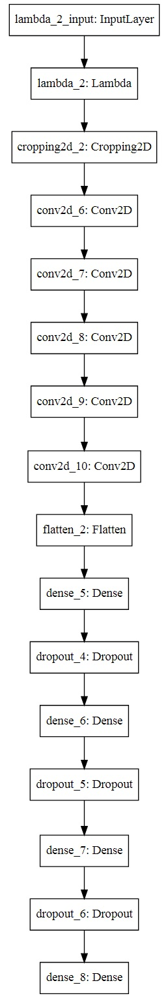
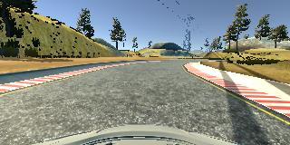
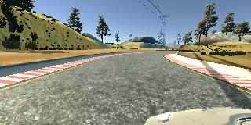
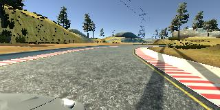
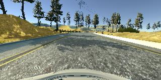
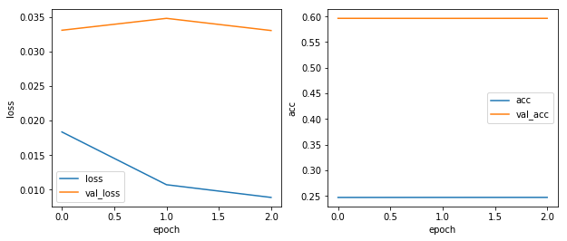

# Behaviorial Cloning Project

#### 1. Solution Design Approach

The overall strategy for deriving a model architecture was to use a good enough CNN.

My first step was to use a convolution neural network model similar to the regression network.

I thought this model might be appropriate because a regression network can predict a continuous number such as [-1.0, 1.0], in this project is the steering angles.

In order to gauge how well the model was working, I split my image and steering angle data into a training and validation set. I found that my first model had a low mean squared error on the training set but a high mean squared error on the validation set. This implied that the model was overfitting. 

To combat the overfitting, I modified the model so that the mean squared error on the validation set maybe low.

So I try a more powerful network architecture, the LeNet.

It seems that the loss decrease pretty well, but not good enough.

Then I try to a much more powerful network architecture, the architecture pubilshed by the autonomous vehicle team at NVIDIA.The model contained a much more deeper layers than the previous model.And then I train the data with this model, because this network is much more powerful, i only need to train one epoch, and I get a pretty nice loss.

#### 2. Final Model Architecture

The final model architecture consisted of a convolution neural network with the following layers and parameters sizes:

<pre>

Layer (type)                 Output Shape              Param #   
=================================================================
lambda_1 (Lambda)            (None, 160, 320, 3)       0         
_________________________________________________________________
cropping2d_1 (Cropping2D)    (None, 65, 320, 3)        0         
_________________________________________________________________
conv2d_1 (Conv2D)            (None, 31, 158, 24)       1824      
_________________________________________________________________
conv2d_2 (Conv2D)            (None, 14, 77, 36)        21636     
_________________________________________________________________
conv2d_3 (Conv2D)            (None, 5, 37, 48)         43248     
_________________________________________________________________
conv2d_4 (Conv2D)            (None, 3, 35, 64)         27712     
_________________________________________________________________
conv2d_5 (Conv2D)            (None, 1, 33, 64)         36928     
_________________________________________________________________
flatten_1 (Flatten)          (None, 2112)              0         
_________________________________________________________________
dense_1 (Dense)              (None, 100)               211300    
_________________________________________________________________
dense_2 (Dense)              (None, 50)                5050      
_________________________________________________________________
dense_3 (Dense)              (None, 10)                510       
_________________________________________________________________
dense_4 (Dense)              (None, 1)                 11        
=================================================================
Total params: 348,219
Trainable params: 348,219
Non-trainable params: 0

</pre>

Here is a visualization of the architecture below:

#### 3. Creation of the Training Set & Training Process

To capture good driving behavior, I first recorded two laps on track one using center lane driving. Here is an example image of center lane driving:

I then recorded the vehicle recovering from the left side and right sides of the road back to center so that the vehicle would learn to steer back to the center. These images show the image captured by the center and the side camera:

Then I repeated this process on track two in order to get more data points.

The top 70 pixels and the bottom 25 pixels of the image mostly capture useless infomations to the data, so I decided to crop thoese pixels to make the data more pure and more usefull.

To augment the data set, I also flipped images and angles thinking that this would help gather more training data and help the model to train on both sides. For example, here is an image that has then been flipped:

 

After the collection process, I had 12272 number of train data points and 768 number of validation data points. I then preprocessed this data by scale pixels between -0.5 and 0.5.

I finally randomly shuffled the data set and put 20% of the data into a validation set. 

I used this training data to train the model. The validation set helped determine if the model was over or under fitting. The ideal number of epochs was 3 as evidenced by the loss history visualized below, and the model run pretty well in autonomous mode. I used an adam optimizer so that manually training the learning rate wasn't necessary.

