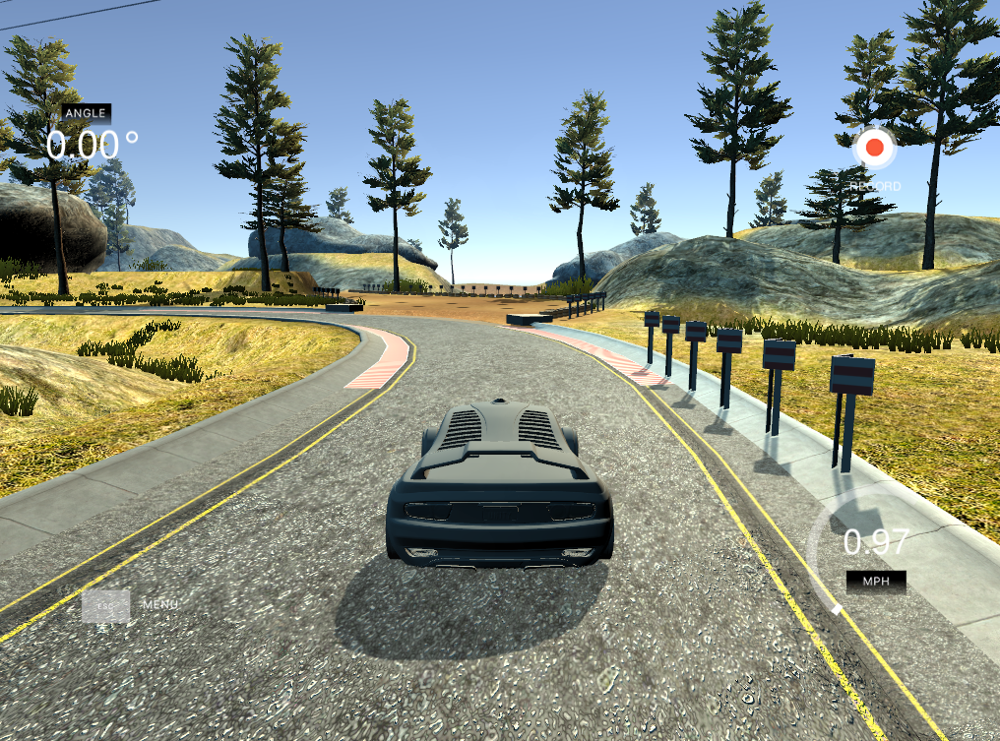

# **Behavioral Cloning** 

## Writeup Template

### You can use this file as a template for your writeup if you want to submit it as a markdown file, but feel free to use some other method and submit a pdf if you prefer.

---

**Behavioral Cloning Project**

The goals / steps of this project are the following:
* Use the simulator to collect data of good driving behavior
* Build, a convolution neural network in Keras that predicts steering angles from images
* Train and validate the model with a training and validation set
* Test that the model successfully drives around track one without leaving the road
* Summarize the results with a written report


## Rubric Points
### Here I will consider the [rubric points](https://review.udacity.com/#!/rubrics/432/view) individually and describe how I addressed each point in my implementation.  

---
### Files Submitted & Code Quality

#### 1. Submission includes all required files and can be used to run the simulator in autonomous mode

My project includes the following files:
* model.py containing the script to create and train the model
* drive.py for driving the car in autonomous mode
* model.h5 containing a trained convolution neural network 
* writeup_report.md or writeup_report.pdf summarizing the results

#### 2. Submission includes functional code
Using the Udacity provided simulator and my drive.py file, the car can be driven autonomously around the track by executing 
```sh
python drive.py model.h5
```

#### 3. Submission code is usable and readable

The model.py file contains the code for training and saving the convolution neural network. The file shows the pipeline I used for training and validating the model, and it contains comments to explain how the code works.

### Model Architecture and Training Strategy

#### 1. An appropriate model architecture has been employed

<pre>

Layer (type)                 Output Shape              Param #   
=================================================================
lambda_1 (Lambda)            (None, 160, 320, 3)       0         
_________________________________________________________________
cropping2d_1 (Cropping2D)    (None, 65, 320, 3)        0         
_________________________________________________________________
conv2d_1 (Conv2D)            (None, 31, 158, 24)       1824      
_________________________________________________________________
conv2d_2 (Conv2D)            (None, 14, 77, 36)        21636     
_________________________________________________________________
conv2d_3 (Conv2D)            (None, 5, 37, 48)         43248     
_________________________________________________________________
conv2d_4 (Conv2D)            (None, 3, 35, 64)         27712     
_________________________________________________________________
conv2d_5 (Conv2D)            (None, 1, 33, 64)         36928     
_________________________________________________________________
flatten_1 (Flatten)          (None, 2112)              0         
_________________________________________________________________
dense_1 (Dense)              (None, 100)               211300    
_________________________________________________________________
dense_2 (Dense)              (None, 50)                5050      
_________________________________________________________________
dense_3 (Dense)              (None, 10)                510       
_________________________________________________________________
dense_4 (Dense)              (None, 1)                 11        
=================================================================
Total params: 348,219
Trainable params: 348,219
Non-trainable params: 0

</pre>

My model consists of 5 convolution neural network with the filter sizes rise from 24x24 to 64x64 and kernel size between 3 and 5, and with (2, 2) strides for the first three convolution neural network.

The model includes RELU layers to introduce nonlinearity, and the data is normalized to [-0.5, 0.5] in the model using a Keras lambda layer. 

The model includes a flatten layer.

The model includes 4 fully connection layers and with dimensionality of the output space 100 -> 50 -> 10 -> 1.

#### 2. Attempts to reduce overfitting in the model

The model contains 3 dropout layers in order to reduce overfitting, with a dropout rate 0.5 to ignore 50% nodes.

The model was trained and validated on different data sets to ensure that the model was not overfitting. 

First I drive the car counter-clock-wise and clock-wise once, and then I trained the model and run the autonomouse mode and found that the car drive to a wrong way at a same spot, so I rerun the training mode, and drive the car to that weird spot and trained the model at that spot multiple times(3 times, clock-wise and counter clock-wise).

The model was tested by running it through the simulator and ensuring that the vehicle could stay on the track.

#### 3. Model parameter tuning

The model used an adam optimizer, so the learning rate was not tuned manually.

#### 4. Appropriate training data

Training data was chosen to keep the vehicle driving on the road. I used a combination of center lane driving, recovering from the left and right sides of the road by drive the car from a counter-clock-wise track and clock-wise track.

For details about how I created the training data, see the next section. 

### Model Architecture and Training Strategy

#### 1. Solution Design Approach

The overall strategy for deriving a model architecture was to use a good enough CNN.

My first step was to use a convolution neural network model similar to the regression network.

I thought this model might be appropriate because a regression network can predict a continuous number such as [-1.0, 1.0], in this project is the steering angles.

In order to gauge how well the model was working, I split my image and steering angle data into a training and validation set. I found that my first model had a low mean squared error on the training set but a high mean squared error on the validation set. This implied that the model was overfitting. 

To combat the overfitting, I modified the model so that the mean squared error on the validation set maybe low.

So I try a more powerful net work architecture, the LeNet.

It seems that the loss decrease pretty well, but not good enough.

Then I try to a much more ppowerful network architecture, the architecture pubilshed by the autonomous vehicl team at NVIDIA.The model contained a much more deeper layers than the previous model.And then I train the data with this model, because this network is much more powerful, i only need to train one epoch, and I get a pretty nice loss.

The final step was to run the simulator to see how well the car was driving around track one. There were a few spots where the vehicle fell off the track just like the image show below, to improve the driving behavior in these cases, I decide to get more data from this spots, that 3 times clock-wise and counter-clock-wise.



At the end of the process, the vehicle is able to drive autonomously around the track one without leaving the road.

#### 2. Final Model Architecture

The final model architecture consisted of a convolution neural network with the following layers and parameters sizes:


<pre>

Layer (type)                 Output Shape              Param #   
=================================================================
lambda_1 (Lambda)            (None, 160, 320, 3)       0         
_________________________________________________________________
cropping2d_1 (Cropping2D)    (None, 65, 320, 3)        0         
_________________________________________________________________
conv2d_1 (Conv2D)            (None, 31, 158, 24)       1824      
_________________________________________________________________
conv2d_2 (Conv2D)            (None, 14, 77, 36)        21636     
_________________________________________________________________
conv2d_3 (Conv2D)            (None, 5, 37, 48)         43248     
_________________________________________________________________
conv2d_4 (Conv2D)            (None, 3, 35, 64)         27712     
_________________________________________________________________
conv2d_5 (Conv2D)            (None, 1, 33, 64)         36928     
_________________________________________________________________
flatten_1 (Flatten)          (None, 2112)              0         
_________________________________________________________________
dense_1 (Dense)              (None, 100)               211300    
_________________________________________________________________
dense_2 (Dense)              (None, 50)                5050      
_________________________________________________________________
dense_3 (Dense)              (None, 10)                510       
_________________________________________________________________
dense_4 (Dense)              (None, 1)                 11        
=================================================================
Total params: 348,219
Trainable params: 348,219
Non-trainable params: 0

</pre>

Here is a visualization of the architecture below:

![alt text][image1]

#### 3. Creation of the Training Set & Training Process

To capture good driving behavior, I first recorded two laps on track one using center lane driving. Here is an example image of center lane driving:


I then recorded the vehicle recovering from the left side and right sides of the road back to center so that the vehicle would learn to steer back to the center. These images show the image captured by the center and the side camera:


Then I repeated this process on track two in order to get more data points.

The top 70 pixels and the bottom 25 pixels of the image mostly capture useless infomations to the data, so I decided to crop thoese pixels to make the data more pure and more usefull.

To augment the data set, I also flipped images and angles thinking that this would help gather more training data and help the model to train on both sides. For example, here is an image that has then been flipped:

 

After the collection process, I had X number of data points. I then preprocessed this data by scale pixels between -0.5 and 0.5.

I finally randomly shuffled the data set and put 20% of the data into a validation set. 

I used this training data for training the model. The validation set helped determine if the model was over or under fitting. The ideal number of epochs was Z as evidenced by the loss history visualize below, and the model run pretty well in autonomous mode. I used an adam optimizer so that manually training the learning rate wasn't necessary.
